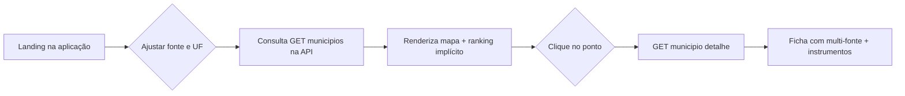
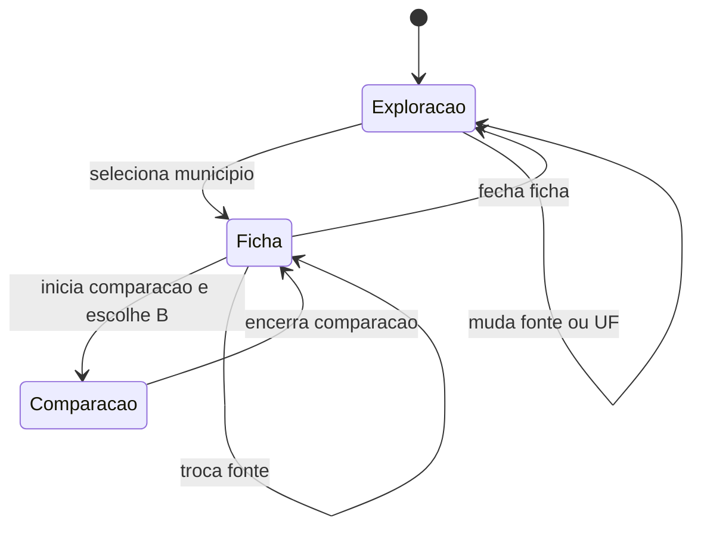

# Radar PID — Manual de usabilidade: arquitetura informacional e fluxos

**Audiência:** usuários finais (triagem territorial), revisores do hackathon e quem faz handoff técnico.  
**Escopo:** interface web em `web/` consumindo a API em `api/` (variável `VITE_API_BASE`; padrão local `http://localhost:8000`).

---

## 1. Objetivo do produto

O Radar PID organiza informação para **priorizar municípios** segundo o **score MCDA por fonte de energia limpa** e apoia a conversa com um **Copiloto** especializado. A linguagem do produto é de **triagem**, não de garantia operacional ou financeira.

---

## 2. Arquitetura informacional

A tela única usa um **único modelo mental**: *escolho a lente (fonte e recorte territorial) → leio o mapa e o ranking → aprofundo em um ou dois municípios → pergunto ao Copiloto em paralelo*.

### 2.1. Regiões da página (zonas)

| Zona | Largura aproximada | Função informacional |
|------|-------------------|----------------------|
| **Barra superior (header)** | Largura total, altura fixa | Identidade PID, narrativa rápida (insights), entrada para **Metodologia**, **tema** claro/escuro |
| **Trilho esquerdo** | ~340 px | **Filtros globais** (fonte × UF), indicador de conexão com API, estado secundário (exploração, ficha ou comparação) |
| **Coluna central** | Fluida | **Índice geográfico**: mapa com pontos proporcionais ao score sob a fonte ativa |
| **Trilho direito** | ~400 px | **Camada dialógica** (Copiloto), sempre visível |

### 2.2. Hierarquia de filtros globais

Tudo que depende do dataset responde a dois controles no topo da coluna esquerda:

1. **Fonte de energia** (Solar, Eólica, Biometano, H₂ Verde, Biomassa). Recalcula escores **por município × fonte** e atualiza mapa, ranking e painéis derivados.
2. **Recorte** (`Brasil` ou **UF**). Restringe a lista e o mapa ao território escolhido; trocar UF **zera** município selecionado e modo comparação (evita referências fora do recorte).

Há também um estado implícito: **API disponível**. Quando os dados são carregados com sucesso, o painel lateral mostra contagem (`n = …`), snapshot métrico e ícone associado ao dataset real.

### 2.3. Estados do trilho esquerdo

O mesmo espaço físico hospeda **três tipos de conteúdo mutuamente excludentes**:

| Estado | Condição de ativação | Conteúdo principal |
|--------|---------------------|---------------------|
| **Exploração** | Nenhum município selecionado | Resumo da fonte ativa, métricas de amostra, **Top 3** clicável, aviso contextual em caso de falha na API |
| **Ficha** | Um município selecionado (sem segundo em comparação válido) | Score da fonte ativa, blocos econômico/social/ambiental, chamada para detalhar **todas as fontes** daquele município via segunda requisição, ações incluindo **comparar** |
| **Comparação** | Dois municípios distintos dentro do recorte atual | Painel lado a lado (**A vs B**), síntese de diferenças e saída do modo |

### 2.4. Sobreposições modais

- **Metodologia** (modal centrado disparado pelo header): explicação do indicador MCDA, vínculos com fontes e limites do MVP. Não substitui a leitura do documento metodológico completo quando existir na pasta de documentação oficial.

---

## 3. Fluxos de uso

### 3.1. Fluxo principal: triagem com mapa

1. Entrar na aplicação sem login.
2. Escolher **fonte** e, se preciso, **UF**.
3. Aguardar o carregamento (mapa atualiza quando a lista retorna).
4. **Hover** para destaque rápido; **clique** para fixar o município.
5. A ficha lateral dispara uma segunda busca (**detalhe por nome**) para trazer pontuações de **todas as cinco fontes** naquele município, além dos dados exibidos no mapa apenas para a fonte ativa.

### 3.2. Fluxo: exploração sem clique inicial

1. Estado **Exploração** mostra texto da fonte selecionada, contagem/snapshot quando a API está ok, e lista **Top 3** atual.
2. Clicar em um item do Top 3 é equivalente a selecionar o município no mapa (atalho para a ficha).

### 3.3. Fluxo: comparação

1. Na ficha, acionar modo **comparar**.
2. Selecionar o **segundo município** no mapa (deve estar no mesmo recorte atual).
3. O trilho esquerdo muda inteiro para o modo **Compare**; no mapa, o segundo ponto recebe destaque visual distinto do primeiro.
4. Sair da comparação restaura a ficha do município primário.

### 3.4. Fluxo: Copiloto (paralelo)

O Copiloto opera **em paralelo** aos fluxos espaciais. O contexto enviado ao backend inclui município selecionado (quando houver) e fonte ativa.

1. Usuário digita ou escolhe sugestão.
2. **POST** `/agente/chat` com `session_id` client-side (continuidade de conversa).
3. Resposta textual é exibida no histórico da coluna direita.

Erros de rede aparecem como mensagem no próprio painel. Não bloqueiam o mapa.

### 3.5. Fluxo: insights no header

1. **GET** `/insights` ao montar o header.
2. Carrossel rotaciona automaticamente entre itens retornados (quando a API responde).

### 3.6. Fluxo de exceção: API indisponível

1. Requisição de municípios falha ou retorna vazio conforme regra da interface.
2. Estado **Exploração** exibe mensagem orientando verificação do servidor (referência a `localhost:8000` em desenvolvimento).
3. Mapa e ranking não têm dataset válido até reconexão; Copiloto e insights podem falhar de forma independente conforme os endpoints.

---

## 4. Mapa de entidades (resumo)

| Entidade na UI | Origem típica | Observação |
|----------------|---------------|------------|
| Lista de pontos no mapa | `GET /municipios` | Parâmetros: `fonte`, `top`, `uf` opcional, `min_completeness` |
| Detalhes multi-fonte na ficha | `GET /municipios/{nome}` | **Nome lookup** deve bater com o contrato da API |
| Insight no carrossel | `GET /insights` | Lista de strings |
| Resposta Copiloto | `POST /agente/chat` | Requer sessão/agente configurado no servidor |
| Preferência visual de tema | `localStorage` | Chave tema persistida no cliente |

---

## 5. Boas práticas de comunicação ao usuário

- Preferir formulários como **oportunidade candidata**, **elegibilidade preliminar** e **priorizar estudo**.
- **Instrumentos públicos** aparecem em caráter **informativo**; não integram o cálculo do score MCDA.
- Mudanças em **UF** reiniciam seleção territorial para evitar leituras incoerentes entre recortes diferentes.

---

## 6. Referências no repositório

- Entrada UI: `web/src/App.jsx` (grade, filtros, estados Exploração/Ficha/Comparação, modal de metodologia).
- Integração REST: `web/src/api.js`.
- Mapa: `web/src/BrazilMap.jsx`.
- Agent: `web/src/Copiloto.jsx`.
- Cheat sheet original do time: `docs/16_manual_usabilidade.md`.

---

*Hackathon E+ Transição Energética 2026 — documento derivado da implementação atual; revisar quando o contrato público ou o layout mudarem.*
